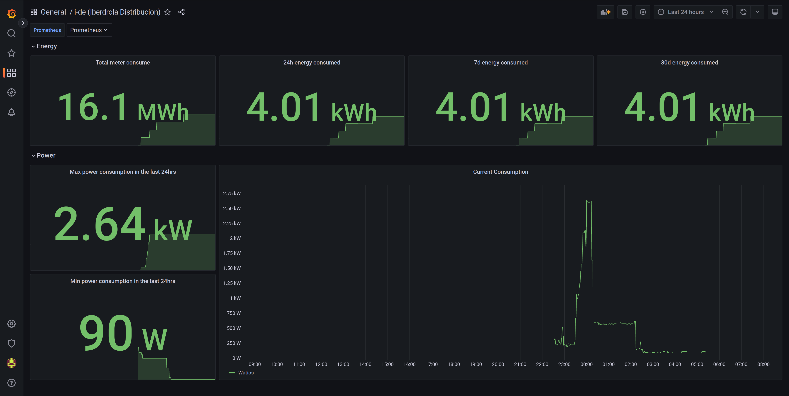

# Iberdrola distribución - Prometheus Exporter

Prometheus exporter for Iberdrola distribución.
It provides current consumption data and the total consumption for the meter.

## Development

```bash
git clone git@github.com:angelbarrera92/iberdrola-distribucion-prometheus-exporter.git
cd iberdrola-distribucion-prometheus-exporter
virtualenv -p python3 venv
source venv/bin/activate
pip install -r requirements-dev.txt
```

### Linting

This requires `docker`. It uses the same linter as the CI.

```bash
make lint
```

## Building

```bash
docker build -t iberdrola-distribucion-prometheus-exporter:local -f build/container/Dockerfile .
```

or

```bash
make build-local
```

## Using

```bash
$ docker run --rm iberdrola-distribucion-prometheus-exporter:local
usage: main.py [-h] [-s SERVER] [-P PORT] -u USERNAME -p PASSWORD [-v]
main.py: error: the following arguments are required: -u/--username, -p/--password
$ docker run -p 9988:9988 iberdrola-distribucion-prometheus-exporter:local -u YOUR_USERNAME_GOES_HERE -p YOUR_PASSWORD_GOES_HERE --verbose
INFO:root:Verbose mode enabled
INFO:root:Exporter server: 0.0.0.0:9988
INFO:root:i-de username: YOUR_USERNAME_GOES_HERE
DEBUG:urllib3.connectionpool:Starting new HTTPS connection (1): www.i-de.es:443
DEBUG:urllib3.connectionpool:https://www.i-de.es:443 "POST /consumidores/rest/loginNew/login HTTP/1.1" 200 343
DEBUG:root:Logged in
INFO:root:Starting exporter server
DEBUG:urllib3.connectionpool:https://www.i-de.es:443 "GET /consumidores/rest/escenarioNew/obtenerMedicionOnline/24 HTTP/1.1" 200 None
```

```bash
$ curl http://localhost:9988/metrics
# HELP python_gc_objects_collected_total Objects collected during gc
# TYPE python_gc_objects_collected_total counter
python_gc_objects_collected_total{generation="0"} 394.0
python_gc_objects_collected_total{generation="1"} 237.0
python_gc_objects_collected_total{generation="2"} 0.0
# HELP python_gc_objects_uncollectable_total Uncollectable object found during GC
# TYPE python_gc_objects_uncollectable_total counter
python_gc_objects_uncollectable_total{generation="0"} 0.0
python_gc_objects_uncollectable_total{generation="1"} 0.0
python_gc_objects_uncollectable_total{generation="2"} 0.0
# HELP python_gc_collections_total Number of times this generation was collected
# TYPE python_gc_collections_total counter
python_gc_collections_total{generation="0"} 55.0
python_gc_collections_total{generation="1"} 4.0
python_gc_collections_total{generation="2"} 0.0
# HELP python_info Python platform information
# TYPE python_info gauge
python_info{implementation="CPython",major="3",minor="11",patchlevel="0",version="3.11.0"} 1.0
# HELP process_virtual_memory_bytes Virtual memory size in bytes.
# TYPE process_virtual_memory_bytes gauge
process_virtual_memory_bytes 3.5516416e+07
# HELP process_resident_memory_bytes Resident memory size in bytes.
# TYPE process_resident_memory_bytes gauge
process_resident_memory_bytes 2.729984e+07
# HELP process_start_time_seconds Start time of the process since unix epoch in seconds.
# TYPE process_start_time_seconds gauge
process_start_time_seconds 1.66927552069e+09
# HELP process_cpu_seconds_total Total user and system CPU time spent in seconds.
# TYPE process_cpu_seconds_total counter
process_cpu_seconds_total 0.24000000000000002
# HELP process_open_fds Number of open file descriptors.
# TYPE process_open_fds gauge
process_open_fds 7.0
# HELP process_max_fds Maximum number of open file descriptors.
# TYPE process_max_fds gauge
process_max_fds 1.048576e+06
# HELP iberdrola_distribucion_consumption Current consumption in watts
# TYPE iberdrola_distribucion_consumption gauge
iberdrola_distribucion_consumption 100.0
# HELP iberdrola_distribucion_meter_total Total consumption in kWh
# TYPE iberdrola_distribucion_meter_total gauge
iberdrola_distribucion_meter_total 16051.0
```

## Prometheus configuration

```yaml
scrape_configs:
  - job_name: 'iberdrola_distribucion'
    static_configs:
      - targets: ['localhost:9988']
```

## Grafana Dashboard

To facilitate the use of this exporter, a [Grafana dashboard](dashboard.json) is provided.



## License

[MIT](LICENSE)
